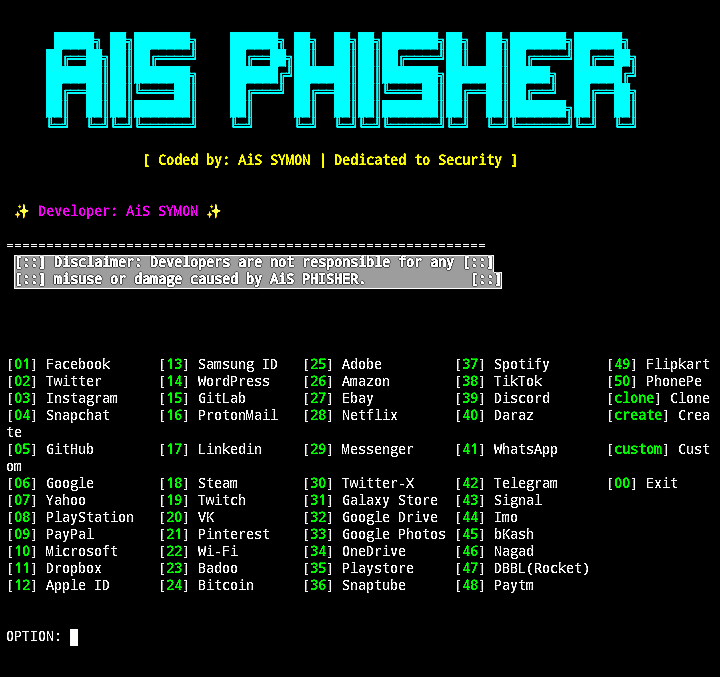
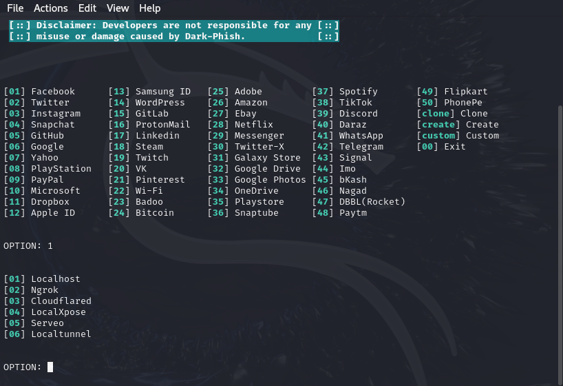

<h2>AiS_PHISHER</h2>
Empowering Ethical Phishing for Security Assessment.

DEVELOPER || 𝘼𝙞𝙎 𝙎𝙔𝙈𝙊𝙉 𝙊𝙁𝙁𝙄𝘾𝙄𝘼𝙇

<p align="center">


<h1 align="center"> AiS_PHISHER v2.3.0</h1>

**AiS_PHISHER** is a specialized phishing tool created for educational and security testing purposes. It provides users with the capability to simulate phishing attacks, enabling the assessment of system vulnerabilities and user awareness.


## Features

- **Multiple Tunneling Options**: Choose from various methods for flexible phishing simulation.

- **Auto-saved Credentials**: Victim credentials are stored automatically.

- **Credential Management**: Easily access and manage saved credentials.

- **Clone Existing Website**: The Clone feature copies a website’s login page for phishing simulations, capturing credentials when users log in.

- **Create Phishing Pages**: The Create feature provides an HTML editor to build phishing pages, allowing full control over design and functionality.

- **Custom Phishing Templates**: The Custom feature provides a pre-built HTML template that can be easily modified to create personalized phishing pages.

- **OTP Capture**: Efficiently collect one-time passwords for improved assessment capabilities.

- **URL Obfuscation:** AiS_PHISHER conceals phishing URLs, making them appear trustworthy and less suspicious.
 
 
 ## Developer
Developed by || 𝘼𝙞𝙎 𝙎𝙔𝙈𝙊𝙉 𝙊𝙁𝙁𝙄𝘾𝙄𝘼𝙇

### Connect with me:
- **YouTube:** [Subscribe here](https://youtube.com/@ais_symon_officialsi=J-7AUYXUVEy-2sga)
- **Telegram:** [Join here](https://t.me/ais_symon_official)
- **Direct Contact:** [Message me](https://t.me/AIS_SYMON)


## Tested on
- Kali Linux
- Termux


## INSTALLATION 💀

```bash
apt install python3 curl php git openssh nodejs npm python3-tk -y
```
```bash
pip3 install requests wget pyshorteners
```
```bash
git clone https://github.com/aissymonofficial/AiS-PHISH.git
cd AiS__PHISHER
```

## Usage 
*Before using AiS_PHISHER, ensure you have the necessary packages installed as mentioned in the installation section.*

     USING 🗿😈

- Run AiS_PHISHER
```bash
python3 AiS_PHISHER.py
```
- For help and usage information
```bash
python3 AiS_PHISHER.py -h
```
- To access saved credentials
```bash
python3 AiS_PHISHER.py -r
```

## Help
```bash

python3 AiS_PHISHER.py -h

Name:
    AiS_PHISHER
    
Usage:
    python3 AiS_PHISHER.py [-h] [-H HOST] [-p PORT] [-u] [-v] [-r]

Version:
    2.3.0

Options:
    -h,  --help                     Show this help massage.
    -H HOST, --host HOST            Specify the host address [Default : 127.0.0.1] . 
    -p PORT,  --port PORT           Web server port [Default : 8080] .
    -u,  --update                   Check for updates.
    -v,  --version                  Show version number and exit.
    -r,  --retrieve                 Retrieve saved credentials.

```

## OTP Capture Technique

 1. When a victim enters their credentials on the phishing page, the attacker immediately receives this information.
 2. The attacker, using the victim's credentials, logs into the legitimate website.
 3. The genuine website sends an actual OTP to the victim.
 4. Believing it's legitimate, the victim enters the OTP on the phishing page.
 5. The attacker intercepts the OTP, gaining access to the victim's credentials and logging in first.


## Available tunnels
1. Localhost
2. Ngrok
3. Cloudflared 
4. LocalXpose 
5. Serveo
6. Localtunnel

## AiS_PHISHER



## Thanks to TheLinuxChoice

## Disclaimer 
***AiS_PHISHER is intended for educational and testing purposes only. Any use of this tool for illegal or unethical activities is strictly prohibited. The authors and contributors are not responsible for any misuse or damage caused by AiS_PHISHER. Use it responsibly and ensure compliance with all applicable laws and regulations in your jurisdiction.***cd AiS-PHISH
# Add installation/dependency commands here
```

## Usage
```bash
python3 AiS_PHISHER.py 
```

## Disclaimer
*This tool is intended for authorized cybersecurity training and educational purposes only. The developers are not responsible for any misuse or illegal activities performed with this tool.*

## License
MIT License
